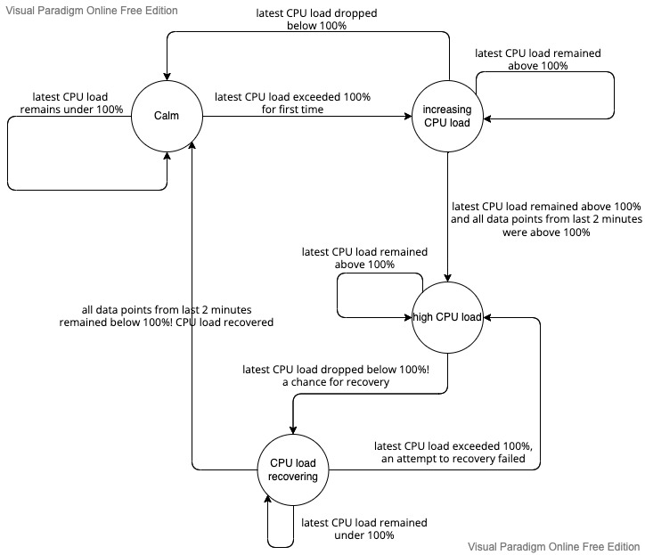

# CPU Load Monitoring project

## https://cpu-load-monitoring.com/

## Available Scripts

 - `npm start` - runs the app in the development mode. Open [http://localhost:3000](http://localhost:3000) to view it in the browser;
 - `startServer` - runs a NodeJS server which listens to `8080` port on http requests and WebSocket connections (path: `/ws`);
 - `build` - builds the app for production to the `build` folder;
 - `test:ut:watch` - runs `jest` testing environment in a watch mode and executes all available unit tests;
 - `test:ut` - as above, but it executes UTs in a single run;
 - `test:it:dev` - builds the application, opens a server which serves the static assets from `build` directory and opens the Cypress Test Runner;
 - `test:it` - as above, but it doesn't run the Cypress Test Runner, but the ITs are executed in a single run;
 - `eslint` - performs static code analysis.

## Alerting logic - State Machine

The alerting logic is described by the above diagram. The feature's state is a state machine. Its correctness is verified by unit tests in the file: `./src/state/reducers.test.ts`.

## Testing

Only reducers (including the transitions between state machine's states) are covered by unit tests.

Integration tests mocks the back-end and verify the application from the user perspective. Tests cases are not independent from each other - their order describes a certain test scenario.

## Open-ended questions

#### How you would extend or improve your application design if you were building this for production?

Things to improve related specifically to application design:
- improve layout responsiveness;
- add an ability to switch to the dark mode;
- add an ability to switch to the compact mode (smaller font sizes, spacings etc.);

Relevant / nice-to-have feature propositions:
 - add an ability to re-arrange the position and size of the panels on Dashboard as user wishes;
 - add an ability to pick a custom time ranges on all panels (that would require B/E support);
 - add more options to customize visual aspects of the panels (background color, text colors, stylize time series etc.);
 - improve alerting feature - browser should trigger browser notifications so that user knows that CPU is under heavy load even if she/he is not on the app's tab;
 - add an ability to customize parameters / thresholds such as 10 seconds (data points fetching frequency) or 2 minutes (duration used in alerting logic);

## Tech stack:

Front-end:
 - `React` as the application view layer tool,
 - `Redux` as a state management tool,
 - `cypress` for integration tests,
 - `jest` for unit tests,
 - `create-react-app` as a tool for generating a project scaffolding,
 - `WebSocket` as a communication protocol, which provides with full-duplex communication channel over a single TCP connection between F/E and B/E,
 - `canvasJS` for time series visualisation,
 - `ag-grid` for data table visualisation.

Back-end:
 - `NodeJS` + `express`,
 - `nginx`,
 - `certbot` + `Let's encrypt` certificate authority for generating a SSL/TSL certificate.

DevOps:
 - the application is deployed e2e on `AWS`: https://cpu-load-monitoring.com/,
 - used services: `AWS EC2`, `AWS Route53`,
 - used `Sumo Logic Real User Monitoring`.

TODO:
 - connection lost
 - pm2 file
 - text panel
